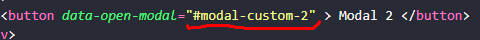

<center> <h1>Como Funcionar</h1> </center>

<br/>

# Para criar um modal
## vc precisa no button que vai abrir o modal ter um data-open-modal e esse valor tem que esta tbm no id do modal que vc quer abrir. **Importante para mascara funcionar e o escorinho que fica por traz do modal essa div com id "mascaraCustomModal" tem que esta no body do html**


<br/>

>### Botão abrir
ele tem que ter o **data-open-modal** e no id do modal tem que ter o mesmo nome que tem nesse data-open-modal

>### Modal Container
**a div que container que tem a class modal-custom** ela tem que ter um id e esse id tem que esta tbm no data-open-modal do botão que vai abrir esse modal

<br/>

# Os Metados
>Metado as Function.

Todas as function tem que inicar quando a pagina for carregada menos uma. (openModalCustom)


## Caso queria que um modal abra outro modal
Pode simplismente colocar no botão do modal que vai abrir outro modal o data-open do modal que vc quer abrir.

**lembrando que ele não vai fechar o modal anterior**


* ### **Para fechar o modal anterior**
Não tem como fechar o modal anterior pq se fechar não tem como volta para ele de novo

* ### **Para fechar o modal atual e volta para anterio**
Na function que esta ouvindo o click do elemento que vai volta pegar o element dela no parametro e passar para essa function
>backPreventModal(e)
```
    function backPreventModal(e){
        let element = e.target
        let modalAtual = $(element).closest('.modal-custom')
        modalAtual.removeClass('visible')
    }

```

<br/>

# Como Estilizar
* Ele ja vem com o css padrão de um modal.

Todos os modals tem que ter a class **modal-custom**, para pode estilizar pode coloca um class unica para modal, ou pelo 

## Para adicionar conteudo. EX: input, text, img
Voce pode estilizar na classe **content-modal**.

Essa classe não esta sendo manipulada pelo css padrão

## Editar o footer. EX: botoes
E na classe **footer-modal-custom**.

Essa classe não esta sendo manipulada pelo css padrão

## Mudar cor do icon de fecha
Ele esta na class **close-modal-custom** pegar o i e dentro do o svg

```
.close-modal-custom{
    i{
        svg{
            // Faz oq vc quer aumenta mudar a cor
        }
    }
}
```

